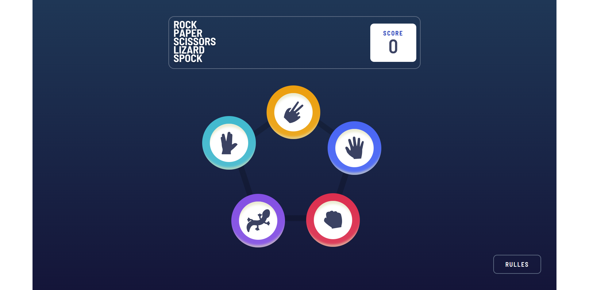

# Frontend Mentor - Rock, Paper, Scissors

## Table of contents

- [Overview](#overview)
  - [The challenge](#the-challenge)
  - [Screenshot](#screenshot)
  - [Links](#links)
- [My process](#my-process)
  - [Built with](#built-with)
  - [What I learned](#what-i-learned)
  - [Continued development](#continued-development)
  - [Useful resources](#useful-resources)
- [Author](#author)
- [Acknowledgments](#acknowledgments)

**Note: Delete this note and update the table of contents based on what sections you keep.**

## Overview

### The challenge

Users should be able to:

- View the optimal layout for the game depending on their device's screen size
- Play Rock, Paper, Scissors against the computer
- Maintain the state of the score after refreshing the browser _(optional)_
- **Bonus**: Play Rock, Paper, Scissors, Lizard, Spock against the computer _(optional)_

### Screenshot

### Links

- Solution URL: [Github](https://github.com/ArtemDerenok/rock-paper-scissors-master)
- Live Site URL: [Deploy](https://jovial-platypus-0d5ca8.netlify.app/)

## My process

### Built with

- HTML5
- SCSS
- Flexbox
- JavaScript
- Mobile-first workflow
- [EsLint](https://eslint.org/) - ESLint is an open source project that helps you find and fix problems with your JavaScript code.
- [WebPack](https://webpack.js.org/) - Webpack is a module bundler

## Author

- Website - [Artem Derenok](https://vermillion-bombolone-14caa7.netlify.app/)
- Frontend Mentor - [@Artem Derenok](https://www.frontendmentor.io/profile/ArtemDerenok)
- LinkedIn - [@Artem Derenok](https://www.linkedin.com/in/artem-derenok-78ba6823b?lipi=urn%3Ali%3Apage%3Ad_flagship3_profile_view_base_contact_details%3BgDz3JUnCS5ywuJw8WKJQcw%3D%3D)
- Telegram - [@Artem Derenok](https://t.me/ARTD95)
